# 自动化（！）

## FISCO-BCOS底层
目前所有的底层自动化测试用例分布在两个平台上：行内统一自动化测试门户和RobotFrameWork。 

### 行内测试门户
目前已基于行内测试平台设计了多个自动化用例，历史自动化用例中，涉及服务器IP、用户名、密码、Port、错误提示信息等都直接固定写在每一个用例中，导致所有的自动化用例只能在固定的机器上面执行，一旦服务器有故障或其他原因导致要在新的服务器上重新搭建环境批跑用例时，需要针对每一个用例修改相关变量，工作量繁琐，不便于用例移植。  
为了解决上述问题，提高自动化用例的可移植性，使其能快速适配不同环境，本次基于行内统一测试平台引入全局变量功能，设计相关自动化用例。本文主要对自动化测试范围、组网、全局变量、用例做相关介绍。 

#### 测试范围
本次自动化用例设计预计覆盖如下测试点（其中部分功能点还未实现），包括节点、console、java-sdk3大类。节点主要从组网类型、操作系统、节点类型、多群组、存储类型、加密类型、连接同步共识、以及大数据量、兼容性等方面展开。console部分主要包括当前所支持的所有命令、历史问题单中重要的场景、历史搜集的solidity合约、客户端与直连节点间的交互等测试点。java-sdk主要包括4种合约类型、客户端与直连节点交互、一定压测背景下的各种操作等。 
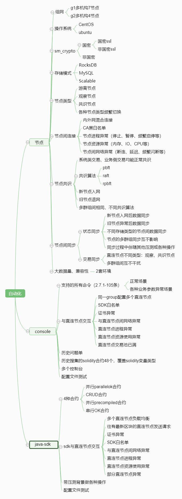 

#### 组网
自动化环境一共有A、B、C、D、E、F、G 7个节点，2个group，其中g1有7个节点（A、B、C、D、E、F、G）,g2有4个节点（A、C、F、G）。正常情况下，节点间是两两网络互通的。 

自动化环境节点间连接IP采用内外网混合模式，Port为外网port。本文以如下组网配置为例，覆盖多群组和不同存储方式（所有节点和客户端分布在4台服务器上：服务器1上有2个节点，服务器2上有1个节点，服务器3上有3个节点，服务器4上有1个节点和2个客户端）。 
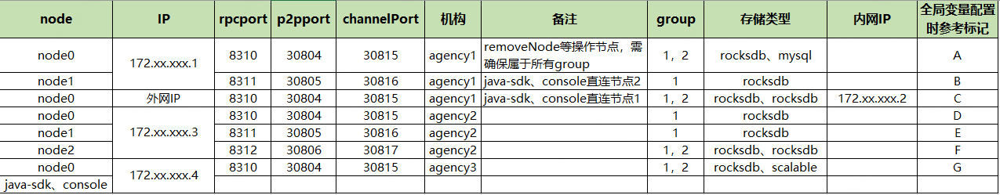 

#### 自动化用例
##### 目录、用例命名规范
目前自动化用例目录结构如下。所有用例在同一个1级目录下，2级目录命名方式参考“0-环境安装”格式：1位数字序号+“-”+特性名称。3级目录格式为：2位数字序号+“-”+功能点，其中第1位数字是2级目录的序号。 
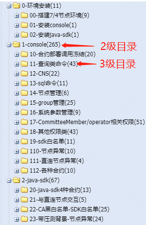 

用例命名格式为：3级目录序号+000开始的3位数字序号+用例场景简短描述，如下图所示。 
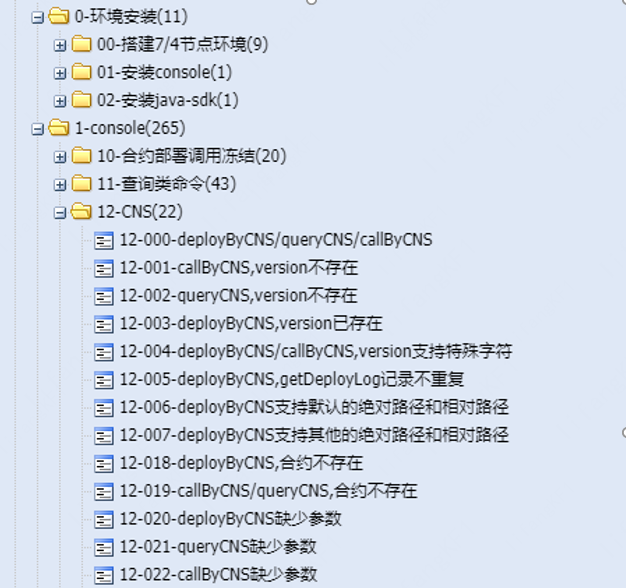 

##### 用例结构
下图是一个完整的自动化用例，验证场景：账户有运维权限才能部署合约，无运维权限部署合约失败。此处以该用例为例介绍用例结构。 
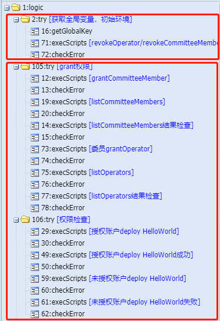 

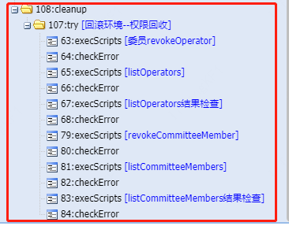 

将上述用例拆分为红框内3部分： 
1. 获取全局变量，初始化环境：获取该用例需要用到的全局变量，转化为用例的内部变量。回收相关账户对应的权限，避免用例后续步骤中赋权失败。其中全局变量获取格式如下，输入参数为事先配置的全局变量，输出参数为用例中定义的变量。输入参数和输出参数一一对应，即输入参数的item 1对应输出参数的item11.如果用例中某变量既有全局变量给它映射值，又有在用例中赋值，此时全局变量映射的值优先级更高。  

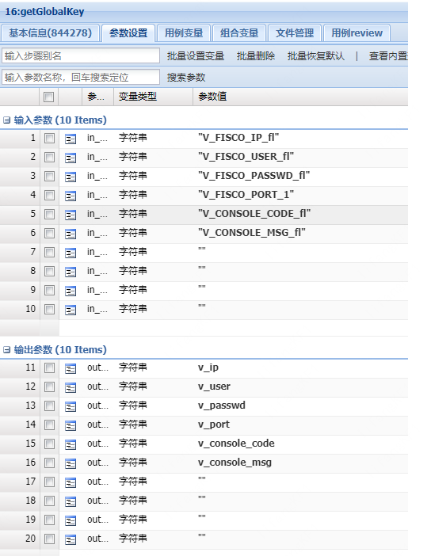 

2. 用例具体操作步骤及结果校验：用例验证场景的具体实施步骤以及每个步骤的结果校验。  
3. Cleanup环境回滚：如果用例中涉及对环境的修改，且该修改会影响其他用例的执行结果时，需要在用例末尾添加环境回滚的步骤。环境回滚的相关步骤应放在cleanup的逻辑中（因为无论前面用例步骤执行是否成功，只要放到cleanup中的步骤都会被执行到）。  

##### 环境搭建
目前环境搭建主要包括节点搭建、安装console、安装java-sdk。  
节点搭建：节点搭建主要包括代码拉取、创建节点、节点分发、节点启动、g1/g2各群组节点共识检查。目前创建节点的时候存储类型均为mysql，节点分发后，会把部分节点改为rocksdb、scalable以保证能覆盖到所有的节点存储类型。  
安装console：包括安装console、配置config.toml及相关证书、备份conf为conf_autocase_bak、保存直连节点的sdk.publickey至con.cfg文件、保存g2 4个节点的nodeid至con.cfg文件、同步con.cfg文件到各节点服务器。  
安装java-sdk：包括安装java-sdk、配置config.toml及相关证书、备份conf为conf_autocase_bak、保存直连节点的sdk.publickey至con.cfg文件、同步con.cfg文件到各节点服务器。  
注意：由于网络原因有时直接git clone代码比较慢，目前已在一台单独的服务器上每隔两个小时拉取编译一次。用例中可以直接从服务器上拉取代码，也可以直接git clone，可直接通过修改全局变量值切换。具体全局变量修改见下节。  

##### 全局变量
全局变量，顾名思义，是所有自动化用例中都能引用到的变量。哪些变量适合做为全局变量呢？在多个用例中被反复用到，且变量值相对固定不变，这类变量就可以被定义为全局变量。如console命令的errorCode、errorMsg，java-sdk-demo的压测命令，搭建节点、console、java-sdk-demo使用到的服务器IP、用户名、密码、目录等。  
目前我们定义了93个全局变量，其中26个变量涉及环境相关的信息，需要在搭建自动化环境前手动修改，所有的全局变量可以查看[基于行内测试门户的自动化介绍](http://km.weoa.com/group/blockchainteam/article/18237)。
 

#### 配置自动化定时执行
定时执行即在配置的时间点自动触发自动化用例执行。当前我们主要是因为如下场景使用到定时执行能力。由于节点支持国密、非国密，且国密节点又支持国密ssl、非国密ssl，而我们每次搭建环境只能覆盖到一种类型，因此我们可以在当前非国密环境批跑完自动化用例后，重新修改全局变量的值，搭建国密环境再一次批跑自动化用例。这里第二次批跑自动化用例的时候就会用到定时执行能力。  
在测试管理—>定时执行配置菜单页新增配置： 
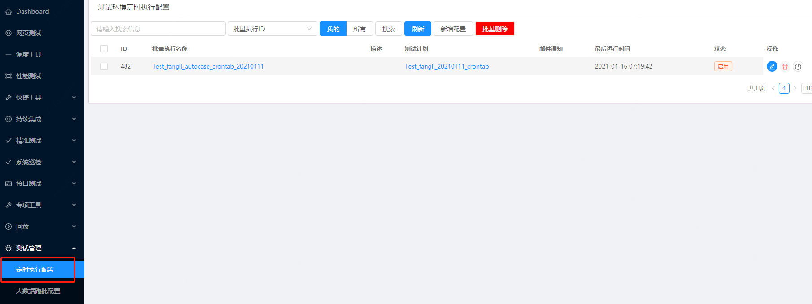 

定时执行配置详情如下，配置好时间计划、关联已有的自动化计划即可。  
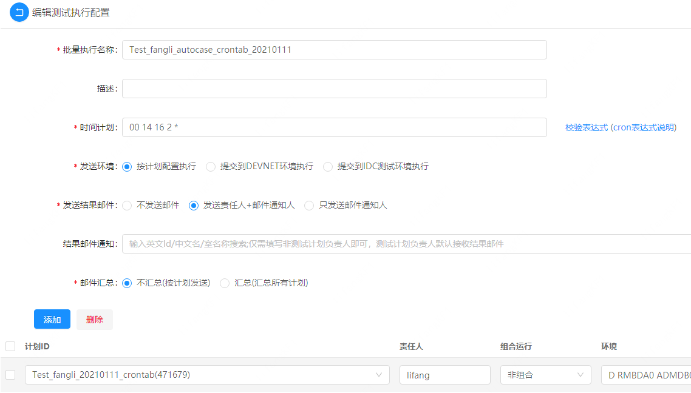 
其中时间计划项配置参考如下Cron表达式格式（配置好后点击右边的校验表达式可以检查下时间配置是否正确）： 
Cron表达式是一个字符串，字符串以 5或6个空格隔开，分为 6或7个域，每一个域代表一个含义，Cron有如下两种语法格式： 
(1) Seconds Minutes Hours DayofMonth Month DayofWeek Year 
(2) Seconds Minutes Hours DayofMonth Month DayofWeek 
cron从左到右（用空格隔开）: 分 小时 月份中的日期 月份 星期中的日期 年份 
表达式各字段的含义如下： 
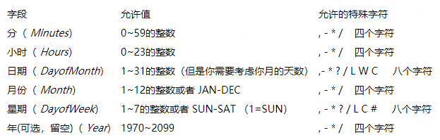 
#### 部署Agent后配置文件修改
之前通过测试平台执行console命令时经常遇到卡死现象，为了解决这一问题，平台提供了agent模块。部署agent后需要修改如下3处配置项： 
1. start.sh中APP_HOME值：
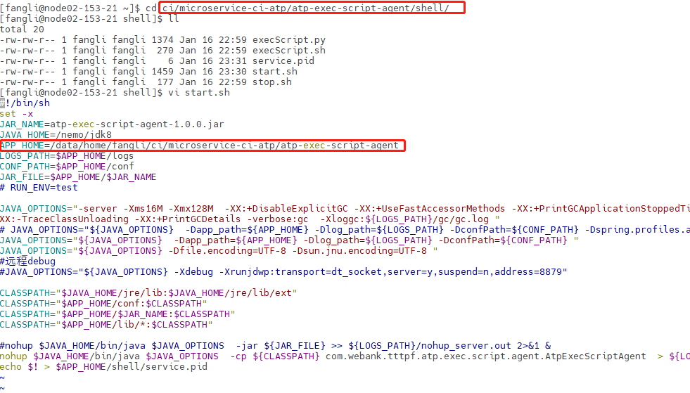 

2. logback.xml中log_path值：
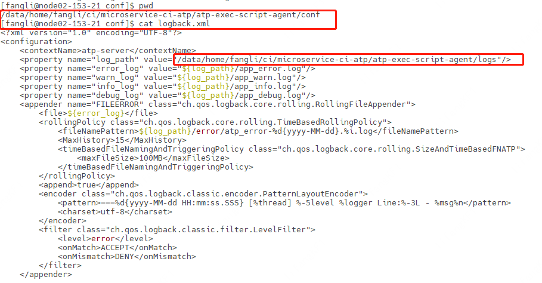 

3. application.properties中server.port配置为没有被占用的端口：
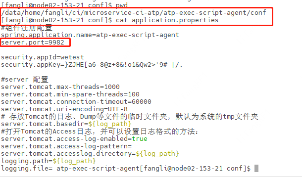 

### RobotFrameWork

## WeBase平台

## WeFamily应用
