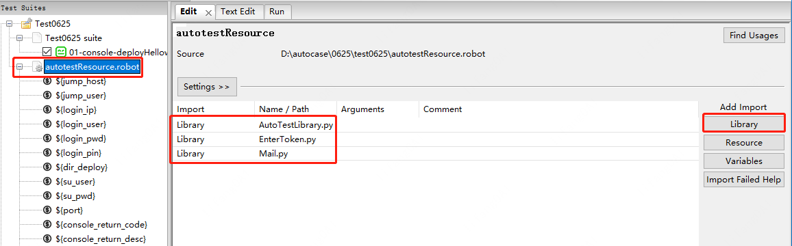
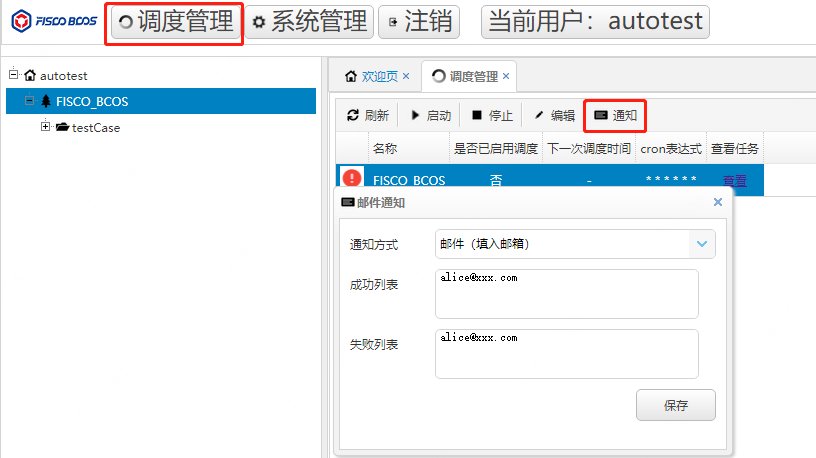

# robotFrameWork
[Robot Framework](https://robotframework.org/)是一个基于Python实现的，可扩展的关键字驱动的开源自动化测试框架，同时支持Python 2和Python 3。Robot框架具有模块化的体系结构：<br/>


- Robot Framework使用表格语法，可用简单统一的方式创建测试用例。
- Robot Framework可从现有关键字创建可重复使用的更高级别关键字。 
- Robot Framework用例执行完成后，可提供易于阅读的HTML格式的Test Report和Test Log。 
- Robot Framework提供Tags标记以分类和选择要执行的测试用例。 
为了让自动化用例编写时更加直观，更容易理解，此次根据fisco-bcos测试的独有特性，在robot framework框架下定制了一套符合FISCO-BCOS测试的一些关键字，使用者需要熟悉FISCO-BCOS底层测试的相关业务，熟悉robot framework内置关键字和定制的FISCO-BCOS专有关键字。<br/>

## 用例编辑工具Ride
Robot Framework框架支持多种用例编辑工具，本次选择[Ride](https://github.com/robotframework/RIDE/wiki)。需要做如下安装（推荐使用Python3）。

### 安装（Python2）
- 安装python：[2.7.18版本](https://www.python.org/downloads/release/python-2718/)
- 安装robotframework：pip install robotframework==3.2.2
- 安装robotframework-ride：pip install robotframework-ride==1.7.4.2（会提示在桌面创建快捷方式）
- 安装robotframework-SSHLibrary：pip install robotframework-SSHLibrary==3.6.0
- 安装configparser：pip install configparser==5.0.1

### 安装（Python3）
- 安装python：[3.7.9版本](https://www.python.org/downloads/release/python-379/)
- 安装robotframework：pip install robotframework==3.2.2
- 安装robotframework-ride：pip install robotframework-ride==1.7.4.2（会提示在桌面创建快捷方式）
- 安装robotframework-SSHLibrary：pip install robotframework-SSHLibrary==3.6.0
- 安装configparser：pip install configparser==5.0.1
注：如果pip install安装太慢可以采用国内镜像，既加上参数 -i https://pypi.douban.com/simple --trust -host=pypi.douban.com

## 创建测试用例
可以直接在ride工具导入已有项目的用例：File->Open Directory（选择项目目录）。也可以新建用例，如下是新建用例的步骤。

### 步骤1.创建项目：File->New Project，Type选择Directory：


### 步骤2.创建Suite：选中项目名，右键->New Suite：


### 步骤3.创建变量文件（存放所有全局变量的文件），选中项目名，右键->New Resource：


变量文件里面可以新增变量和自定义关键字：


变量参考：


自定义关键字参考：


变量Resource文件中需要导入如下3个定制文件（文件中定义了fisco bcos的关键字）：


### 步骤4.创建一个测试用例：选中Suite，右键->New Test Case，用例步骤设计参见下节。

### 步骤5.用例侧导入变量Resource文件：


## 用例结构
用例组成如下，具体可参考[官网描述](http://robotframework.org/robotframework/2.7.2/RobotFrameworkUserGuide.html#test-case-name-and-documentation)。


- Documentation：描述用例场景。
- Setup：用例前置条件，在用例步骤之前执行。
- Teardown：用例后置操作，在用例步骤之后执行，无论用例步骤执行是否成功，Teardown部分始终会被执行。一般回滚环境类的操作需要放在该处，如果放在用例步骤中，可能会出现用例步骤执行失败导致环境回滚步骤不能被执行，进而影响后面的自动化用例。
- Timeout：执行超时时间，超过规定的时间仍未执行完，会被强制中断。
- Template：指定要使用的模板关键字。测试本身将仅包含用作该关键字的参数的数据。
- Tags：给测试用例添加标签。可以从特性维度、用例难易程度等维度给测试用例添加Tag，执行用例时可选择仅执行有对应标签的用例。
- 用例步骤：具体的用例执行步骤，表格式语法，格式：关键字 参数1 参数2；输出变量 关键字 参数1 参数2。

## 用例执行
可以直接在Ride工具中的用例目录上面选中相关用例，然后F8执行。也可以根据用例标签执行指定用例。


## 用例报告
用例执行完成后可以生成html格式的Test Report和Test Log。


Test Log中会记录每个用例的具体执行日志信息：


## Autolink调度页面
通过ride工具只能在本地机器执行用例，不便于共享用例和多人执行。基于此可以搭建一个Autolink平台，只要能访问autolink服务器，就可以登录平台执行用例。

### Autolink搭建
#### 上传软件包
建议Autolink的运行环境为python3.7.9，不支持python2。
将AutoLink压缩包上传到linux服务器，然后解压。

#### 安装依赖
```Bash
#进入AutoLink目录
cd AutoLink
#安装依赖，如果网速很慢，可以加上国内镜像 -i https://pypi.douban.com/simple --trust -host=pypi.douban.com
pip install -r requirements.txt
```
#### 配置
```Bash
#进入auto目录
cd auto
#根据实际情况修改以下配置
#如果当前机器python命令即为python3版本，这里配置成python即可
ROBOT_PYTHON_CMD = "python3"
#本机IP
SERVER_IP = "11.22.33.44"
#服务默认端口，无需修改
SERVER_PORT = "8000"
```
#### 启动服务
```Bash
#进入AutoLink目录
cd AutoLink
sh start.sh
```

#### 停止服务
```Bash
#进入AutoLink目录
cd AutoLink
sh stop.sh
```
### Autolink使用
Autolink主要包括如下几个模块:<br/>
系统管理：新增、删除登陆用户。<br/>
调度管理：配置定时任务信息。<br/>
任务执行模块：配置version、branch参数，触发用例执行。<br/>

#### 登录用户创建
用AutoLink/123456预置用户登录系统，进入系统管理新增，填写相关信息后，点击创建：


#### 用例文件上传
步骤1.选中页面左侧根目录，右键选择创建项目：


步骤2.选中上一步创建的项目，右键选择创建目录：


步骤3.选中上一步创建的目录，右键选择上传文件，上传用例和依赖的测试文件：


需要上传的文件包括：<br/>
autotest_resource_token.robot：变量存储文件<br/>
AutoTestLibrary.py：关键字定义的代码文件<br/>
*.robot：用例文件<br/>

#### 全局变量配置
通过Autolink执行用例时，定义了5个全局变量便于从界面直接传入参数，输入参数后，点击保存参数即可：


使用Autolink执行用例时，需要确保如下部分保持一致：


#### 执行结果通知配置
支持通过邮箱和行内IMS监控发送用例结果通知，配置方法见下图：


#### 用例执行
点击运行，就会运行上传的所有用例。


#### 定时任务调度
Autolink也支持定时任务调度执行。定时任务配置方式如下（其中表达式填写要求满足linux中Cron表达式规则）：


## 附-内置关键字
存储变量时，如果想对现有结果做一定处理或者获取特殊值，以下内置函数可以直接使用，使用时需要带上前缀“self.”。
### 1. timestamp
获取当前时间戳，返回字符串<br/>

### 2. rdm
param1：范围开始值，整数<br/>
param2：范围结束值，整数<br/>
return：该范围的随机数，字符串 str<br/>

### 3. hex2dec
16进制转10进制<br/>
param1：16进制，字符串，例如 0x1a<br/>
return：10进制，字符串 str<br/>

### 4. dec2hex
10进制转16进制<br/>
param1：10进制，字符串<br/>
return：16进制，字符串 str<br/>

### 5. use_key
通过关键字匹配结果，这里首先回去匹配等号键值对，如果没找到就匹配冒号键值对<br/>
param1：需要查找的字符串<br/>
param2：关键字，字符串<br/>
return：匹配到的结果数组（可能匹配到多个），list<br/>

### 6. row_num
指定行号获取值，如果行里面带有等号或者冒号，可以指定具体分隔符来获取值<br/>
param1：需要查找的字符串<br/>
param2：行号，整数<br/>
param3：分隔符：1代表等号，2代表冒号。可不传，则获取该行所有<br/>
return：结果字符串 str<br/>

### 7. get_account
调用get_account.sh脚本创建账户的时候获取信息，get_account.sh执行后会返回三行数据<br/>
param1：需要查找的字符串<br/>
param2：第几行，整数<br/>
return 结果字符串 str<br/>

### 8. get_json
解析json，获得json对象<br/>
param1：json格式的字符串<br/>
return：字典类型 dict<br/>

## 附-Fisco Bcos自定义关键字
### 1.	登录机器—login use token/ login normal
login use token：通过ride工具执行用例，登陆时需要输入token场景使用。<br/>
login normal：不需要输入token的场景使用。<br/>
```Bash
#如果是python2，在登录前需要先指定下字符集为utf-8，因为默认是ascii；如果是python3，该步骤可以忽略
Evaluate    reload(sys)    modules=sys
Evaluate    sys.setdefaultencoding("utf-8")    modules=sys

##设置robot提示符，默认为]$，需要跟linux服务器匹配，如果非该提示符的环境，需要进行设置，否则可以忽略
set prompt    ]#

#输入pin和token登录机器，支持传入部署目录
login use token    ${jump_host}    ${jump_user}    ${login_ip}    ${login_user}    ${login_pwd}    ${login_pin}${token}    dir_deploy=${dir_deploy}

#ssh免密，后面所有ssh和scp操作都免密
login use token    ${jump_host}    ${jump_user}    ${login_ip}    ${login_user}    ${login_pwd}    ${login_pin}${token}    dir_deploy=${dir_deploy}    no_password=True

#登录机器后su到指定用户
login use token    ${jump_host}    ${jump_user}    ${login_ip}    ${login_user}    ${login_pwd}    ${login_pin}${token}    dir_deploy=${dir_deploy}    su_user=${su_user}    su_password=${su_password}

#不需要pin和token登录机器
login normal    ${login_ip}    ${login_user}    ${login_pwd}    dir_deploy=${dir_deploy}
```

### 2.	清理环境—clean
```Bash
#清理登录的当前机器，会清理autotest整个目录
clean

#清理iplist所有机器，会清理autotest整个目录
clean    ip_list=${ip_list}

#只清理节点目录，只会清理autotest下ip目录
clean    ip_list=${ip_list}    ext=node
```
### 3.	代码拉取—install fisco bcos
```Bash
#拉代码，并且编译
install fisco bcos    install_flag=1    git_branch=release-2.7.1

#拉代码，从ci获取二进制
install fisco bcos    install_flag=2    git_branch=release-2.7.1

#不拉代码，从release获取二进制和build_chain.sh
install fisco bcos    install_flag=3    release_version=2.7.1

#不拉代码，从ci获取mini二进制和build_chain.sh
install fisco bcos    install_flag=3    git_branch=release-2.7.1

#从远程服务器直接获取存在的二进制和build_chain.sh
install fisco bcos    install_flag=4    remote_fisco=${remote_fisco}

#从远程服务器直接获取存在的二进制和build_chain.sh，并且更新到其他机器（提前需要调用停止节点的关键字，否则二进制覆盖目标机器会失败）
stop node    ip_list=${ip_list}
install fisco bcos    install_flag=4    remote_fisco=${remote_fisco}    update_flag=True
start node    ip_list=${ip_list}
```
### 4.	创建节点—build chain
```Bash
#创建节点，build_chain.sh需要增加的参数都可以传入ext中
build chain    ipconf=${ip_conf}    ext=-T -i -p 30101,30201,8941

#mysql数据库，数据库名自动生成，即使传入也不会使用
build chain    ipconf=${ip_conf}    ext=-T -i -p 30101,30201,8941 -s mysql    mysql=${mysql_info}

#根据指定ip映射，替换config.ini里面的p2p ip信息，可用于外网ip替换
build chain    ipconf=${ip_conf}    ext=-T -i -p 30101,30201,8941    netmap=${old_ip1}=${new_ip1},${old_ip2}=${new_ip2}
```
### 5.	节点分发—trans node
```Bash
#根据iplist分发节点
trans node    ip_list=${ip_list}
```
### 6.	启动节点—start node
```Bash
#启动当前登录机器所有节点
start node

#启动远程机器的所有节点
start node    ip_list=${ip_list}
start node    ip_list=${ip_list}    ext=all

#启动远程机器所有node0节点
start node    ip_list=${ip_list}    ext=node0
```
### 7.	停止节点—stop node
```Bash
#停止当前登录机器所有节点
stop node

#停止远程机器的所有节点
stop node    ip_list=${ip_list}
stop node    ip_list=${ip_list}    ext=all

#停止远程机器所有node0节点
stop node    ip_list=${ip_list}    ext=node0
```
### 8.	Linux命令行执行—execute linux command
```Bash
#执行pwd，将返回数据存储在RF变量output中
${output}    execute linux command    pwd

#当前目录执行a.sh脚本
execute linux command    bash a.sh

#执行curl，并在结果json中取出result的值，然后转换成十进制存储在变量v_test3中
execute linux command    curl -X POST --data '{"jsonrpc":"2.0","method":"getBlockNumber","params":[1],"id":1}' http://127.0.0.1:8951->v_test3=self.hex2dec(self.get_json(output)["result"])

#创建pem账户
execute linux command    bash get_account.sh->v_pri_key_pem=self.get_account(output,2)    exec_dir=${dir_console}

#执行交互式命令，比如创建p12账户，会询问输入两次密码，为了方便自动化，这里设置的密码默认为123456
execute linux command    bash get_account.sh -p->v_pri_key_p12=self.get_account(output,2)    exec_dir=${dir_console}    interact_input=Password:,123456|Password:,123456
```
### 9.	java-sdk-demo安装—install java sdk demo
```Bash
#安装后，peers只配置protect ip，build_chain时候传入的第一个ip
install java sdk demo    git_branch=main

#安装后，peers配置所有ip
install java sdk demo    git_branch=main    peers=all

#安装后指定peers
install java sdk demo    git_branch=main    peers=ip1:port1,ip2:port2

#从远程机器获取，然后安装
install java sdk demo    git_branch=main    remote=${remote_java_sdk_demo}
```
### 10.	java-sdk-demo调用—execute linux command
```Bash
#执行后会有返回值，存储在了变量press_out_put中
${press_out_put}    execute linux command    java -cp 'apps/*:lib/*:conf/' org.fisco.bcos.sdk.demo.perf.PerformanceOk 50 10 1    exec_dir=${dir_java_sdk_demo}

#断言，查找变量press_out_put中是否包含字符串“Error rate: 0.0%”，如果包含则用例通过
Should Contain    ${press_out_put}    Error rate: 0.0%

#循环执行两次
execute linux command    java -cp 'apps/*:lib/*:conf/' org.fisco.bcos.sdk.demo.perf.PerformanceOk 50 10 1    exec_dir=${dir_java_sdk_demo}    loop_times=2
```
### 11.	console安装—install console
```Bash
#安装后，peers只配置build_chain时候ip_conf传入的第一个ip
install console    git_branch=master

#安装后，peers配置所有ip
install console    git_branch=master    peers=all

#安装后指定peers
install console    git_branch=master    peers=ip1:port1,ip2:port2

#从远程机器获取，然后安装
install console    git_branch=master    remote=${remote_console}
```
### 12.	console调用—execute console command
```Bash
#调用deploy HelloWorld，在返回结果中查找关键字“contract address”对应的值，然后将值存储在变量v_addr中，多个console命令用#隔开
execute console command    deploy HelloWorld->v_addr=self.use_key(output,"contract address")[0];v_t_hash=self.use_key(output,"transaction hash")[0];v_all=v_addr+"|"+v_t_hash#getBlockNumber->v_block_num=output

#loadAccount p12，加载时会被询问要求输入密码，这里默认会用123456密码去加载, v_pri_key_p12为提前存储在autotest.ini里面的变量
execute console command    loadAccount var{v_pri_key_p12} p12

#执行结果返回，然后存储到RF变量
${rst}    execute console command    deploy HelloWorld
```
### 13.	检查节点日志—check log
```Bash
#检查远程机器所有节点日志是否同时包含关键字“g:1”和“+++”，两次查找间隔时间为6秒，结果返回存储在变量check_log_rst中（tuple类型）
${check_log_rst}    check log    ip_list=${ip_list}    ext=all|g:1#+++|6
#断言，${check_log_rst}[0]为是否找到，${check_log_rst}[1]为找到的整行日志
Should Be True    ${check_log_rst}[0]

#在node0日志中查找一次关键字“connected count=1”，如果存在则直接返回true
check log    ip_list=${ip_list}    ext=node0|connected count=1
```
### 14.	删除节点数据—remove node data
```Bash
#删除前先停止机器node0节点
stop node    ip_list=ip,user,password     ext=node0

#删除机器上node0数据
remove node data    ip_list=ip,user,password     ext=node0

#删除后启动机器上node0节点
start node    ip_list=ip,user,password     ext=node0
```
### 15.	操作配置文件—opt autotest ini/opt cfg for fisco bcos
opt autotest ini：读取、修改windows文件autotest.ini。<br/>
opt cfg for fisco bcos：修改linux配置文件
```Bash
#操作 autotest.ini，该文件放在windows上，和当前Suite在一个目录
opt autotest ini    set    name    mark
${name}    opt autotest ini    get    name
log    ${name}

#操作fisco-bcos相关配置文件，linux机器上，被操作机器需要安装configparser（pip install configparser）
execute linux command    cd ${dir_console}/dist/conf
opt cfg for fisco bcos    config.toml    set    cryptoMaterial    test    \\"test1\\"
opt cfg for fisco bcos    ${dir_java_sdk_demo}/dist/conf/config.toml    set    cryptoMaterial    test    \\"test2\\"

#操作机器目录下所有config.ini
execute linux command    cd ${dir_autotest}/${ip}
opt cfg for fisco bcos    config.ini    set    log    level    info

#或者换一种写法，会首先执行cd ${dir_autotest}/${ip}，然后通过find查找config.ini
opt cfg for fisco bcos    ${dir_autotest}/${ip}/config.ini    set    log    level    info

execute linux command    cd ${dir_autotest}/${ip}
opt cfg for fisco bcos    group.1.ini    set    storage    db_name    test
opt cfg for fisco bcos    group.1.ini    del    storage    db_name
```
### 16.	Linux上执行mysql查询—execute mysql
execute mysql：操作mysql数据库，需要安装pymysql：pip install pymysql
```Bash
#查询后的结果中，字段间隔是|，行间隔是！
${sel_rst}    execute mysql    ${mysql_info}    select * from test
log    ${sel_rst}
Should Be Equal    ${sel_rst}    aaa|11!mark|35!
${sel_rst}    execute mysql    ${mysql_info}    select * from test where name='mark';
log    ${sel_rst}
${sel_rst}    execute mysql    ${mysql_info}    select * from test where name="mark";
log    ${sel_rst}
```
### 17.	python sdk安装—install python sdk
```Bash
#如果已经安装过pyenv，可以将pyenv_flag=False，节省安装时间
install python sdk    git_branch=${python_sdk_branch}    remote=${remote_python_sdk}
```
### 18.	python sdk执行—execute linux command
```Bash
#配置环境变量
Execute Linux Command	eval "$(pyenv init -)" && eval "$(pyenv init --path)" && eval "$(pyenv virtualenv-init -)"

#激活python-sdk虚拟环境
Execute Linux Command  cd ${dir_python_sdk} && source ~/.bashrc && pyenv activate python-sdk

#执行具体命令
Execute Linux Command   ./console.py deploy HelloWorld->v_py_contract_addr=self.use_key(output,"contractAddress")[0].replace(",","").replace('"','')
Execute Linux Command   ./console.py getBlockNumber->v_py_bn=self.row_num(output,4,2)

#使python-sdk虚拟环境变为非激活状态
Execute Linux Command    pyenv deactivate python-sdk
```
### 19.	发送邮件—Send Email
```Bash
Send Email    subject=${e_subject}    from_address=${e_from_address}    password=${e_password}    to_addresses=${e_to_addresses}    smtp_server=${e_smtp_server}    attch_files=${e_attch_files}
```

## FAQ
### No module named 'exchangelib'
解决办法：python -m pip install exchangelib

### No module named 'selenium'
解决办法：python -m pip install selenium

### No module named 'SeleniumLibrary'
解决办法：pip install robotframework-selenium2library

### Evaluating expression 'reload(sys)' failed: NameError: name 'reload' is not defined
解决办法：Python版本不匹配

### Ride工具正常显示中文字符
若需在Ride工具中正常显示中文字符，需要修改如下两个配置文件。
 
 
 
 
### No module named configparser
错误提示信息：<br/>
20210311 10:33:17.407 :  INFO : 
> import configparser
> cf = configparser.ConfigParser()
> cf.read('/data/home/lifang/test_RF/autotest/FISCO-BCOS/tools/nodes/172.16.153.45/node0/config.ini')
> print('>>>')
> print(cf.get('rpc', 'channel_listen_port'))
> "
Traceback (most recent call last):
  File "<string>", line 2, in <module>
ImportError: No module named configparser<br/>

解决办法：服务器上安装pip install configparser
 
### FOR loop contains no keywords
错误提示信息：<br/>
20210316 15:58:13.651 :  INFO : ***************check log of g2***************<br/>
20210316 15:58:13.652 :  FAIL : FOR loop contains no keywords.<br/>
20210316 15:58:13.653 :  FAIL : AssertionError<br/>
Ending test:   Test.Mark.环境搭建.检查各节点g1g2共识日志++<br/>

解决办法：在FOR循环语句结束行加上关键字END
 
 


