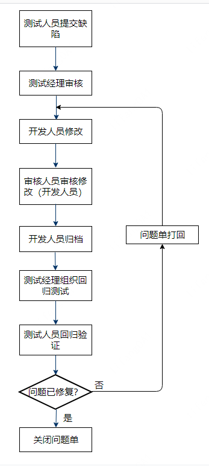
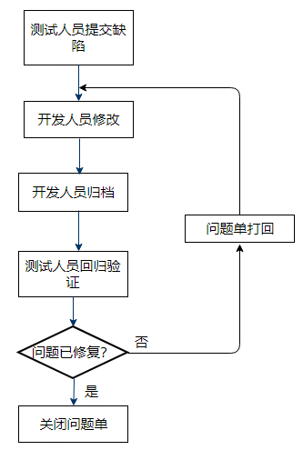

# 平台问题跟踪与管理

## 平台问题跟踪与管理的意义
平台问题跟踪管理，也叫缺陷跟踪管理或问题单跟踪管理，它是测试工作的一个重要部分。一旦有软件缺陷被发现时，就应对其进行跟踪管理，做好平台问题跟踪管理意义重大：可以确保每一个被发现的问题都能被及时得到处理，避免已知问题被漏改的情况发生；有助于团队成员及时了解软件产品在各个过程中所处的质量状态，从而更好地控制产品的质量；可以通过缺陷数据分析（如缺陷来源、严重程度、个数等）来指导测试活动，进而提升产品质量；还可以通过积累缺陷过程数据，积极组织回溯分析，开展软件缺陷预防，作为团队后续持续改进的输入。

## 如何做好平台问题跟踪与管理
#### 步骤1	定义问题级别
问题级别表征了缺陷的严重程度，也代表了开发人员修复缺陷的优先级。同前面故障级别定义类似，可以根据严重程度将缺陷分为以下几个级别，并给每个级别规定一个加权系数值，便于后续计算版本的缺陷密度：

|问题级别             |严重程度      |加权系数          |描述          |
|:---------------:|:-------------:|:-----------:|:-----------|
|L1|Critical 致命|10|系统崩溃，系循环等导致不能正常工作 安全红线类问题等|
|L2|Major 严重|3|严重影响系统基本功能使用|
|L3|Minor 一般|1|影响系统基本功能使用，但有规避途径 影响次要功能实现或部分场景存在问题|
|L4|Suggestion 提示/建议|0.1|提示类错误、优化或建议等|

#### 步骤2	规范问题单描述
一个清晰明了的问题单可以让开发人员快速了解问题场景，大幅降低开发人员与测试人员之间不必要的沟通成本，问题的描述要正确、清晰、规范化，便于开发人员定位分析。一个完整的问题单描述应该包括如下几部分信息： 
-	缺陷标题：简要说明缺陷的内容；
-	缺陷级别：测试人员根据定义的问题单级别据实给出缺陷严重程度估计。
-	缺陷版本：发现缺陷的版本号。
-	缺陷模块：缺陷所属模块。
-	是否必现：缺陷是必现的还是偶然发生的。
-	缺陷详情： 
	预置条件：出现该缺陷所需的前提条件。 
	操作步骤：缺陷发生所需的操作步骤。 
	预期结果：理论上的正确结果。 
-	实际结果：由于版本有缺陷，实际的测试结果。
-	缺陷发现时间：发现缺陷的时间。
-	期望解决时间：期望解决缺陷的时间。

#### 步骤3	明确问题单相关人员责任
一个问题单的整个生命周期中会有如下人员参与，各自责任如下：

|角色             |责任|
|:---------------:|:-------------|
|测试人员|发现缺陷并按规范提交问题单；在缺陷被修复后回归验证|
|测试经理|审核问题单，并将问题单指派给对应开发人员|
|开发人员|修复缺陷、验证缺陷|

#### 步骤4	制定问题单流转流程
问题单流程通常分为标准流程和简短流程，一般在传统的瀑布开发模式中，使用标准问题单流程较多，在敏捷开发模式中大多使用简短流程。
标准流程如下：

简短流程如下：

#### 步骤5	制定缺陷处理要求
为了约束缺陷生命周期中各参与人员的行为，需要制定一个缺陷处理原则，如： 
（1）测试人员发现缺陷后，应及时在系统中提交缺陷，避免在测试周期后期爆发大量缺陷，给开发人员造成修改压力。 
（2）开发人员应按缺陷的严重程度进行修复。 
（3）测试人员需积极主动跟踪所提交的缺陷，并做好修复后的验证工作，直至缺陷关闭。 
（4）缺陷回归验证时，需考虑系统功能或数据间的关联性，尽可能验证所有关联内容。 
（5）对于在本次测试周期中仍不能关闭的缺陷，需与产品经理、项目经理、开发人员、测试经理、测试人员达成一致意见，方可遗留。若无法达成一致意见，需要向上升级，由上级领导裁定。 
（6）对于遗留、未关闭的缺陷，需及时安排版本修复，并提供临时解决方案。 

#### 步骤6	统计、分析缺陷数据
测试经理可以从系统中导出缺陷数据来分析版本质量。如版本测试结束时，测试经理可以过滤出当前版本的所有问题单，按如下公式算出缺陷密度值：假设当前版本有1个致命问题，5个严重问题，15个一般问题，5个提示问题，代码量为15K。则所有问题单的加权系数和为1*10+5*3+15*1+5*0.1=40.5，缺陷密度DI（density of issues）=问题单加权系数和/代码量=40.5/15=2.7，通过跟历史版本对比来评估当前版本的质量。 
此外，还可以从缺陷所属模块维度出发，统计出缺陷较高的模块，后续回归验证时重点验证该模块。 

#### 步骤7	确保问题闭环
测试经理在版本发布前需要过滤出当前版本的所有问题单、历史版本遗留至当前版本的问题单，确保每个问题单（除经决策可以遗留到下个版本的问题单外）都已走到关闭状态，才能终止当前版本的测试活动。
