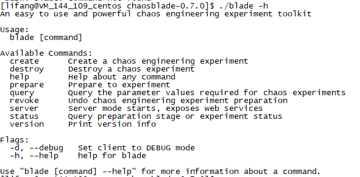
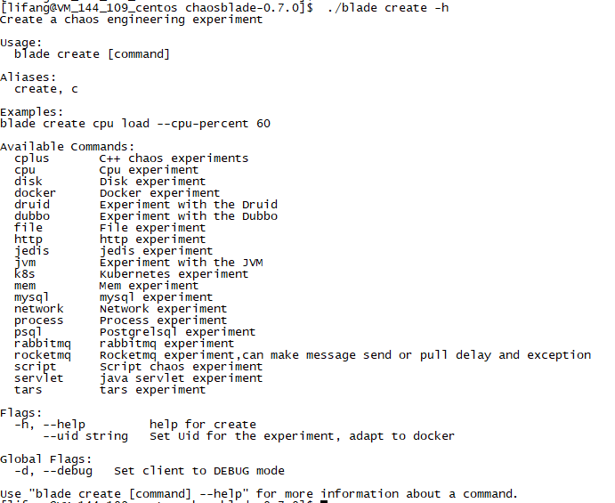
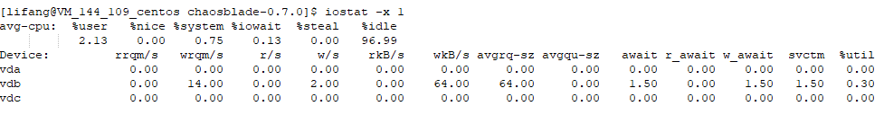
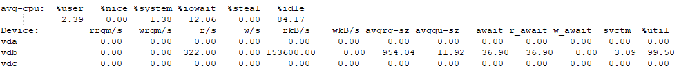
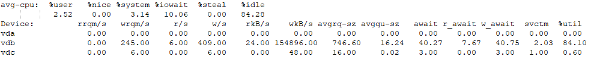

# 故障模拟工具ChaosBlade
受到各种内外部因素的影响，现网运行的生产环境较家里测试环境复杂，根据以往经验来看，现网环境出现的很多非功能问题在家里环境难遇到。为尽量减少遗漏到下游的非功能问题，减少故障的最好方法就是让故障经常性的发生，可以在家里测试时模拟一些异常场景，观察系统的表现，持续提升系统的容错和弹性能力。<br/>

本文介绍一款开源的故障模拟工具Chaosblade，Chaosblade是阿里巴巴内部的MonkeyKing开源项目，它基于阿里巴巴近十年的故障测试和实践，结合了集团业务的最佳理念和实践。ChaosBlade 是一款遵循混沌工程实验原理，提供丰富故障场景实现，帮助分布式系统提升容错性和可恢复性的混沌工程工具，可实现底层故障的注入，特点是操作简洁、无侵入、扩展性强。<br/>

Chaosblade可以通过模拟调用延迟、服务不可用、机器资源满载等，查看发生故障的节点或实例是否被自动隔离、下线。可以通过模拟杀服务Pod、杀节点、增大Pod资源负载，观察系统服务可用性，验证副本配置、资源限制配置以及Pod下部署的容器是否合理。可以通过模拟上层资源负载，验证调度系统的有效性；模拟依赖的分布式存储不可用，验证系统的容错能力；模拟调度节点不可用，测试调度任务是否自动迁移到可用节点；模拟主备节点故障，测试主备切换是否正常。可以通过对系统注入故障，验证监控指标是否准确，监控维度是否完善，告警阈值是否合理，告警是否快速，告警接收人是否正确，通知渠道是否可用等，提升监控告警的准确和时效性。<br/>

## 下载 chaosblade
获取 chaosblade 最新的release包（https://github.com/chaosblade-io/chaosblade/releases/，当前最新的是9月底发布的0.7.0版本），目前支持linux/amd64 和 darwin64。<br/><br/>
```Bash
wget https://github.com/chaosblade-io/chaosblade/releases/download/v0.7.0/chaosblade-0.7.0-linux-amd64.tar.gz
```
下载完成后解压即可，无需编译，解压后目录结构如下：
```Bash
[lifang@VM_144_109_centos ~]$ tar xvzf chaosblade-0.7.0-linux-amd64.tar.gz
[lifang@VM_144_109_centos chaosblade-0.7.0]$ tree -L 2
├── bin
│   ├── chaos_addfile
│   ├── chaos_appendfile
│   ├── chaos_burncpu
│   ├── chaos_burnio
│   ├── chaos_burnmem
│   ├── chaos_changedns
│   ├── chaos_chmodfile
│   ├── chaos_deletefile
│   ├── chaos_dropnetwork
│   ├── chaos_filldisk
│   ├── chaos_fuse
│   ├── chaos_killprocess
│   ├── chaos_movefile
│   ├── chaos_occupynetwork
│   ├── chaos_stopprocess
│   └── chaos_tcnetwork
├── blade
├── lib
│   ├── cplus
│   └── sandbox
└── yaml
    ├── chaosblade-cplus-spec.yaml
    ├── chaosblade-docker-spec-0.7.0.yaml
    ├── chaosblade-jvm-spec-0.7.0.yaml
    ├── chaosblade-k8s-spec-0.7.0.yaml
    └── chaosblade-os-spec-0.7.0.yaml
其中 blade 是可执行文件，chaosblade 工具的 cli。
```

## 查看帮助
ChaosBlade有丰富的故障注入功能，部分故障对一些复杂的linux命令进行了封装，使用起来更简单。本文介绍几种简单常用的故障，后续大家需要用到其他的故障时可以自行深入研究。<br/>

执行 ./blade help 或./blade -h可以查看当前版本支持哪些命令：<br/>
 

对几个常用命令解释如下：
- ``create：``也可以简写为c，创建一个混沌演练实验，也即执行故障注入。命令格式./blade create [TARGET] [ACTION] [FLAGS]，比如模拟一次CPU2内核cpu耗尽，则执行的命令为./blade create cpu fullload --cpu-list 2，如果注入成功，则返回实验的uid，用于状态查询和销毁此实验使用。
- ``Destroy：``也可简写为d，销毁之前的混沌实验，比如销毁上面提到的cpu满载实验，命令是./blade destroy UID
- ``Prepare：``也可简写为p，故障前的准备，比如演练Java应用，则需要挂载java agent。要演练应用名是business 的应用，则在目标主机上执行./blade p jvm process business。如果挂载成功，返回挂载的uid，用于状态查询或者撤销挂载使用。
- ``Revoke：``也可简写为r，撤销之前故障的准备，比如卸载java agent。命令是./blade revoke UID。
- ``Status：``也可简写为s，查询准备阶段或者实验的状态，命令是./blade status UID或者./blade status --type create。<br/><br/>
所有的命令都可以添加 -h 来查看此命令如何使用，如创建故障：
 

## 模拟CPU特定负载
Chaosblade利用消耗CPU时间片来模拟CPU具体的使用率：可以模拟CPU满载、可以指定几个内核注入该故障、可以指定具体哪些内核注入故障、可以指定CPU具体负载百分比。目的是为了验证系统在特定CPU负载下的表现以及弹性伸缩能力等。模拟CPU负载的相关参数如下：
- ``--timeout string``   设定运行时长，单位是秒，通用参数
- ``--cpu-count string``     指定 CPU 满载的个数
- ``--cpu-list string``      指定 CPU 满载的具体核，核索引从 0 开始 (0-3 or 1,3)
- ``--cpu-percent string``   指定 CPU 负载百分比，取值在 0-100

#### 1.注入CPU满载故障
注入故障前，top命令查看CPU idle为95.6%：
```
%Cpu(s):  2.9 us,  1.5 sy,  0.0 ni, 95.6 id,  0.0 wa,  0.0 hi,  0.0 si,  0.0 st
```
注入cpu满载故障（./blade create cpu fullload,返回"success":true表示注入故障成功。result后的id即UID，在解除故障时需要用到）：
```Bash
[lifang@VM_144_109_centos chaosblade-0.7.0]$ ./blade create cpu fullload
{"code":200,"success":true,"result":"95602e1c3107724c"}
```
注入故障后，再次查看CPU使用率，可看出CPU已被耗尽：
```Bash
%Cpu(s): 23.4 us, 76.5 sy,  0.0 ni,  0.0 id,  0.0 wa,  0.0 hi,  0.0 si,  0.0 st
KiB Mem : 16267496 total,   442844 free,  2520472 used, 13304180 buff/cache
KiB Swap:        0 total,        0 free,        0 used. 13409488 avail Mem 
   PID USER      PR  NI    VIRT    RES    SHR S  %CPU %MEM     TIME+ COMMAND                                              
108611 lifang    20   0  111852   7720      4 S 787.7  0.0   4:40.23 chaos_burncpu      
```
解除故障后，CPU使用率恢复：
```Bash
[lifang@VM_144_109_centos chaosblade-0.7.0]$ ./blade destroy 95602e1c3107724c
{"code":200,"success":true,"result":{"Target":"cpu","Scope":"","ActionName":"fullload","ActionFlags":{},"ActionPrograms":null}}
```

#### 2.随机指定两个内核满载故障
命令：./blade create cpu fullload --cpu-count 2。注入故障后，top命令查看各个内核使用率，随机指定的cpu1、cpu3已被耗尽：
``` Bash
Tasks: 170 total,   1 running, 169 sleeping,   0 stopped,   0 zombie
%Cpu0  :  0.9 us,  0.9 sy,  0.0 ni, 98.2 id,  0.0 wa,  0.0 hi,  0.0 si,  0.0 st
%Cpu1  : 21.5 us, 78.5 sy,  0.0 ni,  0.0 id,  0.0 wa,  0.0 hi,  0.0 si,  0.0 st
%Cpu2  :  6.0 us,  2.3 sy,  0.0 ni, 91.7 id,  0.0 wa,  0.0 hi,  0.0 si,  0.0 st
%Cpu3  : 22.6 us, 77.4 sy,  0.0 ni,  0.0 id,  0.0 wa,  0.0 hi,  0.0 si,  0.0 st
%Cpu4  :  0.9 us,  0.9 sy,  0.0 ni, 98.2 id,  0.0 wa,  0.0 hi,  0.0 si,  0.0 st
%Cpu5  :  1.4 us,  0.0 sy,  0.0 ni, 98.6 id,  0.0 wa,  0.0 hi,  0.0 si,  0.0 st
%Cpu6  :  0.5 us,  0.5 sy,  0.0 ni, 99.1 id,  0.0 wa,  0.0 hi,  0.0 si,  0.0 st
%Cpu7  :  0.5 us,  0.5 sy,  0.0 ni, 99.1 id,  0.0 wa,  0.0 hi,  0.0 si,  0.0 st
```
#### 3.指定具体某些内核满载
命令：./blade create cpu fullload --cpu-list 2。注入故障后，可看出cpu2已被耗尽：
```Bash
%Cpu0  :  6.0 us,  2.3 sy,  0.0 ni, 91.7 id,  0.0 wa,  0.0 hi,  0.0 si,  0.0 st
%Cpu1  :  1.7 us,  1.7 sy,  0.0 ni, 96.6 id,  0.0 wa,  0.0 hi,  0.0 si,  0.0 st
%Cpu2  : 24.0 us, 76.0 sy,  0.0 ni,  0.0 id,  0.0 wa,  0.0 hi,  0.0 si,  0.0 st
%Cpu3  :  0.7 us,  0.3 sy,  0.0 ni, 99.0 id,  0.0 wa,  0.0 hi,  0.0 si,  0.0 st
%Cpu4  :  1.3 us,  1.0 sy,  0.0 ni, 97.7 id,  0.0 wa,  0.0 hi,  0.0 si,  0.0 st
%Cpu5  :  0.7 us,  1.3 sy,  0.0 ni, 98.0 id,  0.0 wa,  0.0 hi,  0.0 si,  0.0 st
%Cpu6  :  6.0 us,  2.7 sy,  0.0 ni, 91.4 id,  0.0 wa,  0.0 hi,  0.0 si,  0.0 st
%Cpu7  :  8.3 us,  0.7 sy,  0.0 ni, 91.0 id,  0.0 wa,  0.0 hi,  0.0 si,  0.0 st
```
#### 4.指定具体的CPU负载百分比
若测试过程中需要关注系统在不同负载场景下的表现，工具也可以指定具体的CPU负载百分比，如指定80%负载：./blade create cpu fullload --cpu-percent 80
注入故障后，可看出cpu总体使用率大概80%，剩余cpu idle 大概20%，会有少许误差：
```Bash
%Cpu(s): 16.8 us, 62.7 sy,  0.0 ni, 20.5 id,  0.0 wa,  0.0 hi,  0.0 si,  0.0 st
```
## 模拟磁盘IO负载
Chaosbale内部通过dd命令实现提升磁盘读、写IO，可以指定受影响的目录。用该故障可以验证在磁盘IO高负载场景下，系统的稳定性、服务监控告警等。参数如下：
- ``--path string``      指定提升磁盘 io 的目录，会作用于其所在的磁盘上，默认值是 /
- ``--read``             触发提升磁盘读 IO 负载，会创建 600M 的文件用于读，销毁实验会自动删除
- ``--size string``      块大小, 单位是 M, 默认值是 10，一般不需要修改，除非想更大的提高 io 负载
- ``--timeout string``   设定运行时长，单位是秒，通用参数
- ``--write``            触发提升磁盘写 IO 负载，会根据块大小的值来写入一个文件，比如块大小是 10，则固定的块的数量是 100，则会创建 1000M 的文件，销毁实验会自动删除

下面以/data目录所在磁盘vdb为例，模拟磁盘IO负载的效果：
```Bash
[lifang@VM_144_109_centos chaosblade-0.7.0]$ df -lh|grep data
/dev/vdb        493G  377G   91G  81% /data
```
#### 1.提升磁盘读IO
命令：./blade create disk burn --read --path /data/home/lifang。注入故障前，可以用iostat -x 1命令监控磁盘IO，iowait为0，IO负荷基本为0：
  

注入故障后，再次用iostat -x 1命令监控磁盘IO，可发现：故障后vdb磁盘产生的读IO请求多，导致iowait较之前增大，IO基本满负荷。
  

#### 2.提升磁盘写IO
命令：./blade create disk burn --write --path /data/home/lifang。注入故障后磁盘IO如下，故障后vdb磁盘产生的写IO请求多，iowait较之前增大，磁盘使用率达80%+。
  

Chaosblade工具也可同时提升磁盘的读写IO，命令：./blade create disk burn --read --write --path /data/home/lifang，需要时可以模拟看下效果，此处不再介绍。<br/><br/>
在区块链测试时，节点的所有目录只用到了一个磁盘，验证时需要检查：当节点所在磁盘IO使用率很高时，节点异常不参与打包共识，但当故障解除后，节点应能立即开始同步状态，待同步状态OK后正常参与业务打包共识。当服务器上其他磁盘IO高时，节点应不受影响，能正常工作。

## 模拟磁盘目录使用率
Chaosblade内部使用了fallocate、dd命令来模拟磁盘目录填充，可以指定目录文件的大小。相关参数如下：
- ``--path string``      需要填充的目录，默认值是 /
- ``--size string``     需要填充的文件大小，单位是 M，取值是整数，例如 --size 1024
- ``--reserve string``   保留磁盘大小，单位是MB。取值是不包含单位的正整数，例如 --reserve 1024。如果 size、percent、reserve 参数都存在，优先级是 percent > reserve > size
- ``--percent string``   指定磁盘使用率，取值是不带%号的正整数，例如 --percent 80
- ``--retain-handle``    是否保留填充
- ``--timeout string``   设定运行时长，单位是秒，通用参数

如注入磁盘满载故障，注入后，磁盘使用率会立即达到100%:
```Bash
[lifang@VM_144_109_centos chaosblade-0.7.0]$ df -lh
Filesystem      Size  Used Avail Use% Mounted on
/dev/vdb        493G  377G   91G  81% /data

[lifang@VM_144_109_centos chaosblade-0.7.0]$ ./blade c disk fill --path /data/home/lifang –size 100000
{"code":200,"success":true,"result":"b2688da45494ed00"}

[root@VM_144_109_centos chaosblade-0.7.0]# df -lh
Filesystem      Size  Used Avail Use% Mounted on
/dev/vdb        493G  471G     0 100% /data
```
在区块链系统中，当节点所在磁盘使用率100%时，该节点进程会退出，节点目录下面产生coredump，但由于空间已满，core大小为0。故障撤销后需要重启该节点进程，节点同步状态OK后正常参与业务打包共识。

## 模拟内存占用高
Chaosblade可以模拟服务器内存占用过高的场景，内部通过两种方式提高内存使用率：ram模式采用代码申请内存实现；cache模式采用dd、mount命令实现，挂载tmpfs并且进行文件填充。相关故障参数如下：
- ``--mem-percent string``    内存使用率，取值是 0 到 100 的整数
- ``--mode string``   内存占用模式，有ram和cache两种，默认值是--mode cache，cache模式需要用root用户执行，效果更明显
- ``--reserve string``    保留内存的大小，单位MB，若有mem-percent参数，优先使用 mem-percent 参数
- ``--rate string`` 内存占用速率，单位是 MB/S，仅在 --mode ram 时生效
- ``--timeout string``   设定运行时长，单位是秒，通用参数

命令参考./blade c mem load --mode cache --mem-percent 100 --timeout 300。<br/><br/>
故障注入后，可以通过top命令或者free -m命令查看剩余内存。需要注意：触发内存占用满时，即使指定了--timeout参数，也可能出现通过blade工具无法恢复的情况，之前模拟时遇到过好几次都是不能恢复，此时可以通过重启服务器解决。<br/><br/>
在区块链系统中，当节点所在服务器内存太高甚至耗尽时，操作系统会很卡，节点不能参与正常打包共识。故障撤销后，节点会开始同步状态，待同步OK后正常参与业务打包共识。

## 模拟进程异常
Chaosblade可以模拟进程终止（验证系统的故障隔离能力）、进程暂停场景（验证系统某节点hang死时，系统的容错能力）。进程终止是通过kill -9 PID实现，进程暂停是通过kill -STOP PID实现，进程暂停恢复通过kill -CONT PIDS现，这里直接使用linux命令操作会比工具更方便。<br/><br/>
测试中需要注意的是，正常时进程是S状态，能正常处理业务。进程暂停后，进程状态会变为T状态，没有时间片运行代码，不能处理业务。但当进程暂停故障恢复后，系统应能自动恢复正常，满足基本可靠性能力。
```Bash
[lifang@VM_144_109_centos chaosblade-0.7.0]$ ps -aux |grep 47829|grep fis
lifang    47829 17.2  6.7 2196048 1092016 ?     Sl   Sep21 6229:10 /data/home/lifang/nodes/172.16.144.109/node0/../fisco-bcos -c config.ini

[lifang@VM_144_109_centos chaosblade-0.7.0]$ kill -STOP 47829

[lifang@VM_144_109_centos chaosblade-0.7.0]$ ps -aux |grep 47829|grep fis
lifang    47829 17.2  6.7 2196048 1095420 ?     Tl   Sep21 6229:14 /data/home/lifang/nodes/172.16.144.109/node0/../fisco-bcos -c config.ini

[lifang@VM_144_109_centos chaosblade-0.7.0]$ kill -CONT 47829

[lifang@VM_144_109_centos chaosblade-0.7.0]$ ps -aux |grep 47829|grep fis
lifang    47829 17.2  6.1 2196048 1002588 ?     Sl   Sep21 6229:23 /data/home/lifang/nodes/172.16.144.109/node0/../fisco-bcos -c config.ini
```

## 模拟网络异常
Chaosblade可模拟常见的网络异常，如网络延迟、网络丢包、网络包重复、网络包损坏、网络包乱序、网络本地端口占用等，主要是验证网络异常的情况下，系统的自我容错能力。<br/><br/>
需注意网络相关的故障需要用root用户模拟，实名用户没有权限操作。网络相关的故障参数较多，这里不再介绍，需要的可通过./blade create network -h查看。

#### 1.网络延迟
工具内部通过tc命令实现。延迟的时候可以指定网卡、本地或远程端口、目标IP。<br/><br/>
需注意，如果不指定端口、ip 参数，而是整个网卡延迟，切记要加--timeout参数或者--exclude-port参数，前者是指定运行时间，自动停止销毁实验，后者是指定排除掉的延迟端口，两者都是防止因延迟时间设置太长，造成机器无法连接的情况。如果确实忘记带这俩参数，后续可通过重启服务器恢复。<br/><br/>
如模拟本机与172.16.144.64机器之间网络延迟5秒。正常网络连接时，两台机器间时延很小：<br/>
```Bash
64 bytes from 172.16.144.64: icmp_seq=57 ttl=64 time=0.239 ms
64 bytes from 172.16.144.64: icmp_seq=58 ttl=64 time=0.239 ms

注入网络延迟5秒的故障：

[root@VM_144_109_centos chaosblade-0.7.0]#  ./blade create network delay --time 5000 --timeout 60 --destination-ip 172.16.144.64 --interface  eth0
{"code":200,"success":true,"result":"66363788525615c6"}

注入故障后，ping检查延迟：
[root@VM_144_109_centos chaosblade-0.7.0]# ping 172.16.144.64
PING 172.16.144.64 (172.16.144.64) 56(84) bytes of data.
64 bytes from 172.16.144.64: icmp_seq=1 ttl=64 time=5000 ms
64 bytes from 172.16.144.64: icmp_seq=2 ttl=64 time=5000 ms
64 bytes from 172.16.144.64: icmp_seq=3 ttl=64 time=5008 ms
```

#### 2.网络丢包
可以指定网卡、本地端口、远程端口、目标 IP 丢包。<br/><br/>
需注意，如果不指定端口、ip 参数，而是整个网卡丢包，切记要添加--timeout参数或者--exclude-port参数，两者都是防止因丢包率设置太高，造成机器无法连接的情况，如果真实发生此问题，重启机器即可。<br/><br/>
正常时，通过mtr命令查看两个服务器之间网络丢包情况，其中Loss%表示丢包率：
```Bash
[lifang@VM_144_109_centos chaosblade-0.7.0]$ mtr -n --report 172.16.144.64
Start: Mon Oct 19 11:04:01 2020
HOST: VM_144_109_centos           Loss%   Snt   Last   Avg  Best  Wrst StDev
  1.|-- 172.16.144.64              0.0%    10    0.3   0.3   0.3   0.3   0.0

模拟本机与172.16.144.64间丢包率60%:
[root@VM_144_109_centos chaosblade-0.7.0]# ./blade create network loss --percent 60 --interface eth0 --destination-ip 172.16.144.64
{"code":200,"success":true,"result":"71c755555d5493ff"}

Ping命令查看存在丢包情况：
[root@VM_144_109_centos chaosblade-0.7.0]# ping 172.16.144.64
PING 172.16.144.64 (172.16.144.64) 56(84) bytes of data.
64 bytes from 172.16.144.64: icmp_seq=1 ttl=64 time=0.264 ms
64 bytes from 172.16.144.64: icmp_seq=4 ttl=64 time=0.246 ms
64 bytes from 172.16.144.64: icmp_seq=8 ttl=64 time=0.222 ms
64 bytes from 172.16.144.64: icmp_seq=9 ttl=64 time=0.253 ms
64 bytes from 172.16.144.64: icmp_seq=11 ttl=64 time=0.226 ms
64 bytes from 172.16.144.64: icmp_seq=13 ttl=64 time=0.281 ms

mtr命令查看本机与172.16.144.64的网络丢包率（丢包率有时候会存在一些误差）：
[root@VM_144_109_centos chaosblade-0.7.0]# mtr -n --report 172.16.144.64
Start: Mon Oct 19 11:05:56 2020
HOST: VM_144_109_centos           Loss%   Snt   Last   Avg  Best  Wrst StDev
  1.|-- 172.16.144.64             60.0%    10    0.3   0.3   0.2   0.3   0.0
```

#### 3.网络包重复
可以指定网卡、本地端口、远程端口、目标IP包重复。同前面一样，如果不指定端口、ip参数，而是整个网卡包重复，切记要添加--timeout参数或者--exclude-port参数。<br/><br/>
模拟本机与172.16.144.64之间网络包重复：
```Bash
[root@VM_144_109_centos chaosblade-0.7.0]# ./blade create network duplicate --destination-ip 172.16.144.64 --percent 50 --interface eth0
{"code":200,"success":true,"result":"4f2b7e818db955a3"}

ping命令查看结果：
64 bytes from 172.16.144.64: icmp_seq=984 ttl=64 time=0.251 ms
64 bytes from 172.16.144.64: icmp_seq=984 ttl=64 time=0.260 ms (DUP!)
64 bytes from 172.16.144.64: icmp_seq=985 ttl=64 time=0.443 ms
64 bytes from 172.16.144.64: icmp_seq=985 ttl=64 time=0.458 ms (DUP!)
64 bytes from 172.16.144.64: icmp_seq=986 ttl=64 time=0.271 ms
64 bytes from 172.16.144.64: icmp_seq=986 ttl=64 time=0.295 ms (DUP!)
64 bytes from 172.16.144.64: icmp_seq=987 ttl=64 time=0.275 ms
64 bytes from 172.16.144.64: icmp_seq=987 ttl=64 time=0.287 ms (DUP!)
64 bytes from 172.16.144.64: icmp_seq=988 ttl=64 time=0.272 ms
64 bytes from 172.16.144.64: icmp_seq=988 ttl=64 time=0.282 ms (DUP!)
64 bytes from 172.16.144.64: icmp_seq=989 ttl=64 time=0.286 ms
64 bytes from 172.16.144.64: icmp_seq=989 ttl=64 time=0.297 ms (DUP!)
64 bytes from 172.16.144.64: icmp_seq=990 ttl=64 time=0.269 ms
64 bytes from 172.16.144.64: icmp_seq=991 ttl=64 time=0.292 ms
```
网络相关的还有网络乱序、端口被占用等故障，这里就不一一列举了。需要用到的可以自行./blade create network -h查看。

## 其他
Chaosblade工具也可模拟docker、kubernetes、java相关的故障，这里简单列举下当前的功能，需要用到的可以自行./blade create -h查看具体使用方法。<br/>

Chaosblade工具也可模拟docker相关的故障，比如杀容器，容器网络延迟、丢包，杀容器里的进程等，不同的场景依赖的参数不同，目前支持以下实验场景：<br/>
blade create docker container 容器自身场景，比如杀容器<br/>
blade create docker cpu 容器内CPU负载场景<br/>
blade create docker network 容器内网络场景<br/>
blade create docker process 容器内进程场景<br/>

Chaosblade工具也可创建 kubernetes 相关的实验场景，除了使用 blade 命令创建场景外，还可以将实验使用 yaml 文件描述，使用 kubectl 命令执行。目前支持的实验场景如下：<br/>
blade create k8s node-cpu Node 节点 CPU 负载场景<br/>
blade create k8s node-network Node 节点网络场景<br/>
blade create k8s node-process Node 节点进程场景<br/>
blade create k8s node-disk Node 节点磁盘场景<br/>
blade create k8s pod-pod Pod 资源场景，比如杀 Pod<br/>
blade create k8s pod-network Pod 网络资源场景，比如网络延迟<br/>
blade create k8s pod-IO Pod IO 文件系统异常场景<br/>
blade create k8s container-container Container 资源场景，比如杀容器<br/>
blade create k8s container-cpu 容器内 CPU 负载场景<br/>
blade create k8s container-network 容器内网络场景<br/>
blade create k8s container-process 容器内进程场景<br/>

Chaosblade工具也可模拟jvm 相关的场景，可以指定类，方法注入延迟、返回值、异常故障场景，也可以编写 groovy 和 java 脚本来实现复杂的场景。目前支持的场景如下:<br/>
blade create jvm CodeCacheFilling 填充 jvm code cache<br/>
blade create jvm OutOfMemoryError 内存溢出，支持堆、栈、metaspace 区溢出<br/>
blade create jvm cpufullload java 进程 CPU 使用率满载<br/>
blade create jvm delay 方法延迟<br/>
blade create jvm return 指定返回值<br/>
blade create jvm script 编写 groovy 和 java 实现场景<br/>
blade create jvm throwCustomException 抛自定义异常场景<br/>
