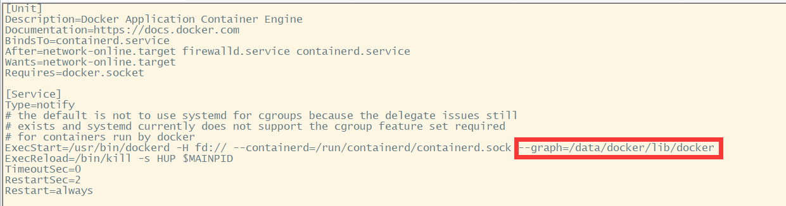

# docker的/var/lib/docker目录迁移
工作过程中经常会遇到/var/lib/docker/overlay2 占用空间很大导致/目录磁盘空间满。此处介绍一种/var/lib/docker目录迁移方法。

## 停止docker服务
```Bash
systemctl stop docker.service
```
## 查找目标目录
通过命令df -h 看下磁盘大概的情况，找一个大的空间。

## 创建docker新目录
```Bash
mkdir -p /data1/docker1/lib
注：参数-p 确保目录名称存在，如果目录不存在的就新创建一个。
```
## 迁移
```Bash
rsync -avzP /var/lib/docker /data1/docker1/lib/
参数解释：
• -a，归档模式，表示递归传输并保持文件属性。
• -v，显示rsync过程中详细信息。可以使用"-vvvv"获取更详细信息。
• -P，显示文件传输的进度信息。(实际上"-P"="--partial --progress"，其中的"--progress"才是显示进度信息的)。
• -z,   传输时进行压缩提高效率。
```
## 配置新docker目录
```Bash
vim /lib/systemd/system/docker.service
在ExecStart加入:  
 --graph=/data1/docker1/lib/docker
```

## 重启docker
```Bash
systemctl daemon-reload
systemctl restart docker
systemctl enable docker
```
## 检查Docker Root Dir参数值
docker info命令查看Docker Root Dir参数值是否正确。
```Bash
[root@VM_108_46_centos lib]# docker info|grep 'Docker Root Dir'
WARNING: bridge-nf-call-iptables is disabled
WARNING: bridge-nf-call-ip6tables is disabled
 Docker Root Dir: /data/docker1/lib/docker
```
## 删除旧目录/var/lib/docker/
启动之后确认docker 没有问题，删除旧的/var/lib/docker/目录，到此迁移docker目录工作结束。


