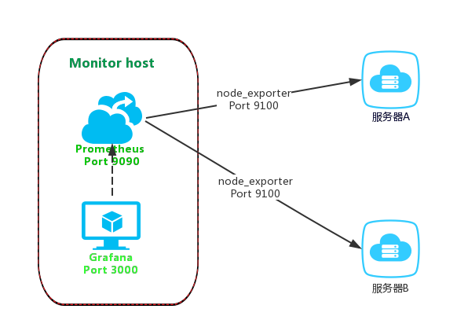
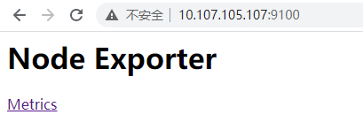
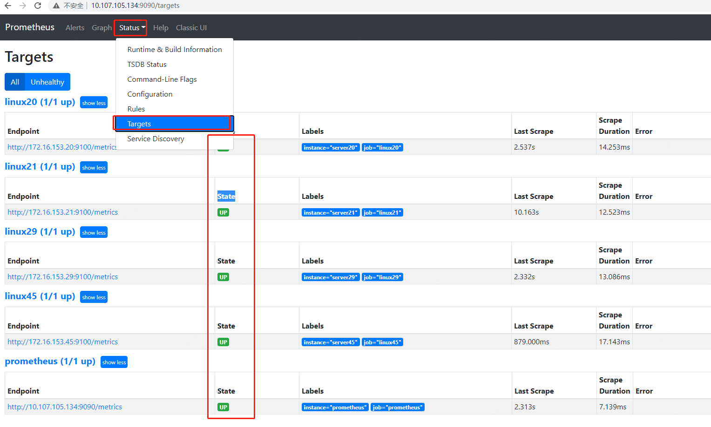
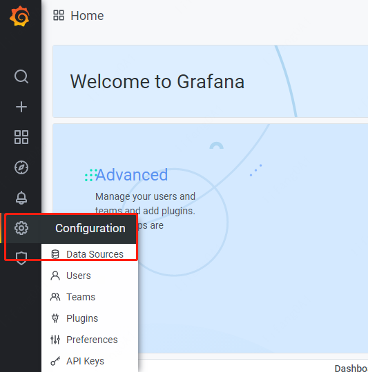
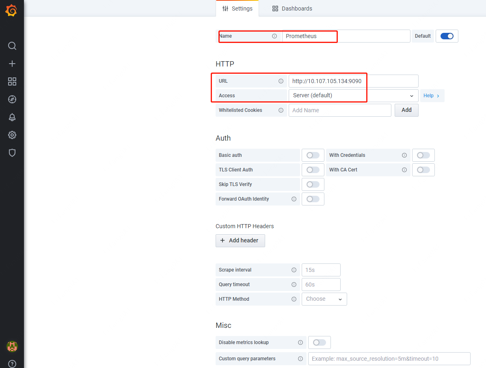
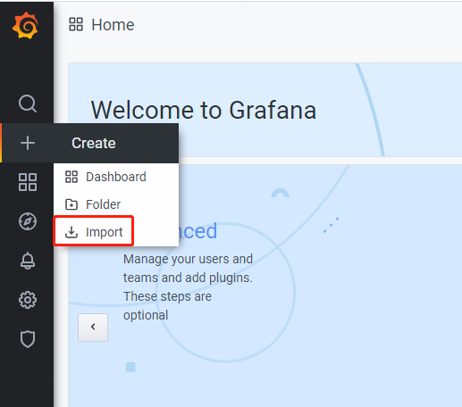
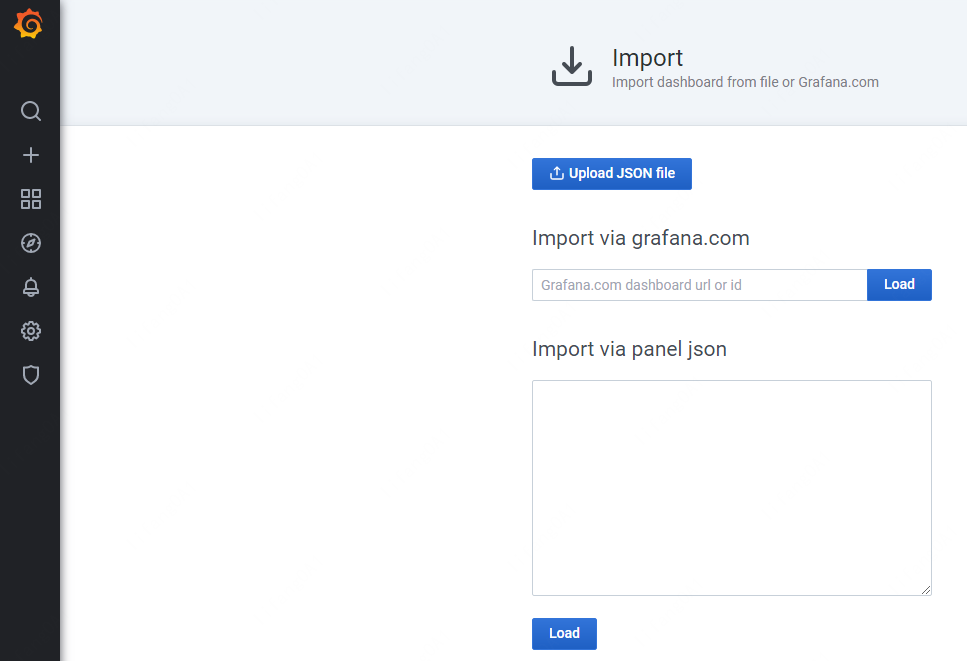
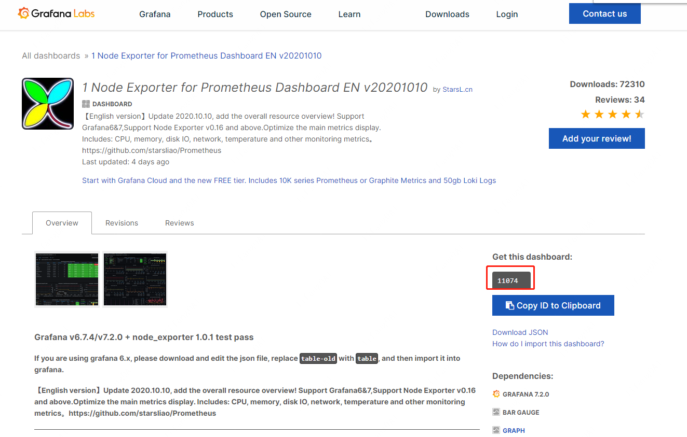
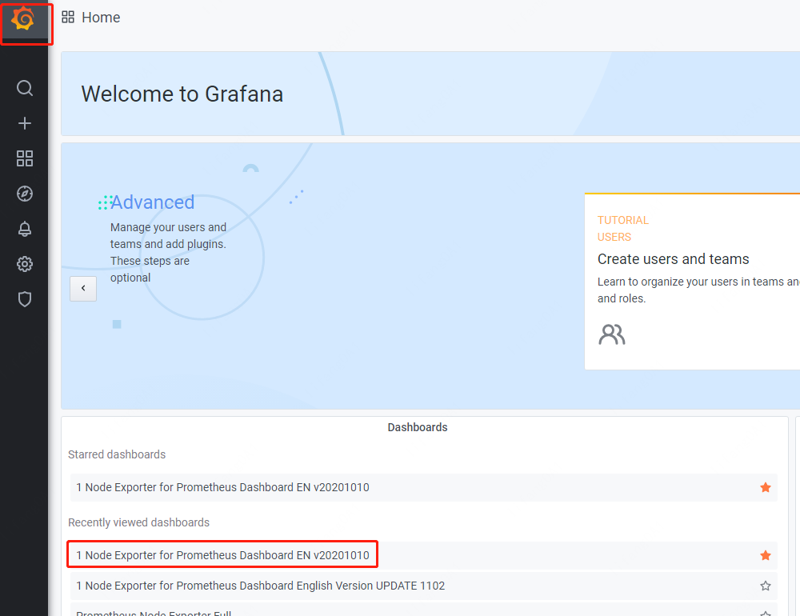
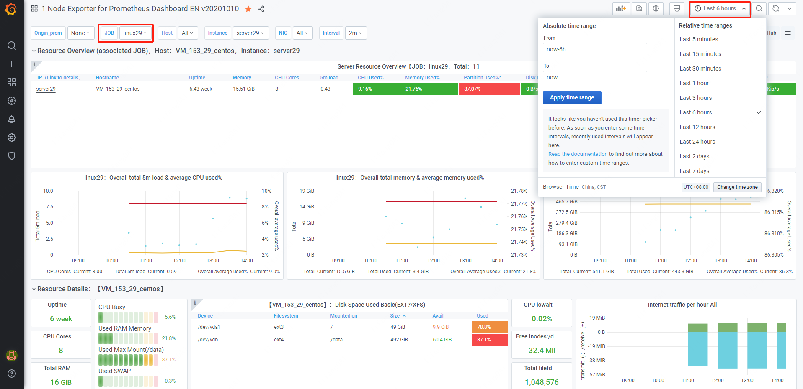

# node_exporter+Prometheus+Grafana监控系统

本文基于node_exporter、Prometheus、Grafana搭建一套监控系统，方便性能压测过程中监控各个服务器节点的资源使用情况，三者工作原理如下图所示：node_exporter负责从各个被监控服务器采集资源使用情况；prometheus负责根据配置文件发现监控目标，主动收集并存储node_exporter采集到的数据指标；grafana负责读取prometheus数据并通过可视化图表展示。


## node_exporter
### 简介
在Prometheus的架构设计中，Prometheus Server并不直接服务监控特定的目标，其主要任务负责数据的收集，存储并且对外提供数据查询支持。因此为了能够能够监控到某些东西，如主机的CPU使用率，我们需要使用到Exporter。Prometheus周期性的从exporter暴露的HTTP服务地址（通常是/metrics）拉取监控样本数据。本次采用node_exporter采集各主机的cpu、内存、带宽、磁盘等资源的使用情况。
更多资料请参考：https://prometheus.io/docs/guides/node-exporter/

### 安装
node_exporter需要安装在每个被监控的服务器上。安装步骤如下：
#### 1.获取软件包
从https://github.com/prometheus/node_exporter/releases下载对应操作系统的node_exporter包并解压，下载最新版本即可：
wget https://github.com/prometheus/node_exporter/releases/download/v1.0.1/node_exporter-1.0.1.linux-amd64.tar.gz

#### 2.解压软件包
```Bash
tar xvzf node_exporter-1.0.1.linux-amd64.tar.gz -C /usr/local/bin
```
#### 3.启动node_exporter
通过如下命令启动node_exporter：
```Bash
nohup /usr/local/bin/node_exporter-1.0.1.linux-amd64/node_exporter &
```
启动后可以查到相关进程：
```Bash
ps -ef |grep export
root     24578 19324  0 16:09 pts/0    00:00:00 /usr/local/bin/node_exporter-1.0.1.linux-amd64/node_exporter
```
根据netstat -anp|grepPID可以看到node_exporter使用的端口为9100：
```Bash
netstat -anp|grep 24578
tcp6       0      0 :::9100                 :::*                    LISTEN      24578/node_exporter
```
也可以从node_exporter的启动日志中查看端口号：
```Bash
level=info ts=2021-02-09T08:06:33.858Z caller=node_exporter.go:177 msg="Starting node_exporter" version="(version=1.0.1, branch=HEAD, revision=3715be6ae899f2a9b9dbfd9c39f3e09a7bd4559f)"
level=info ts=2021-02-09T08:06:33.862Z caller=node_exporter.go:178 msg="Build context" build_context="(go=go1.14.4, user=root@1f76dbbcfa55, date=20200616-12:44:12)"
level=info ts=2021-02-09T08:06:33.862Z caller=node_exporter.go:105 msg="Enabled collectors"
level=info ts=2021-02-09T08:06:33.862Z caller=node_exporter.go:112 collector=arp
level=info ts=2021-02-09T08:06:33.862Z caller=node_exporter.go:112 collector=bcache
level=info ts=2021-02-09T08:06:33.862Z caller=node_exporter.go:112 collector=bonding
level=info ts=2021-02-09T08:06:33.862Z caller=node_exporter.go:112 collector=btrfs
level=info ts=2021-02-09T08:06:33.862Z caller=node_exporter.go:112 collector=conntrack
level=info ts=2021-02-09T08:06:33.862Z caller=node_exporter.go:112 collector=cpu
level=info ts=2021-02-09T08:06:33.862Z caller=node_exporter.go:112 collector=cpufreq
level=info ts=2021-02-09T08:06:33.862Z caller=node_exporter.go:112 collector=diskstats
level=info ts=2021-02-09T08:06:33.862Z caller=node_exporter.go:112 collector=edac
level=info ts=2021-02-09T08:06:33.862Z caller=node_exporter.go:112 collector=entropy
level=info ts=2021-02-09T08:06:33.862Z caller=node_exporter.go:112 collector=filefd
level=info ts=2021-02-09T08:06:33.862Z caller=node_exporter.go:112 collector=filesystem
level=info ts=2021-02-09T08:06:33.862Z caller=node_exporter.go:112 collector=hwmon
level=info ts=2021-02-09T08:06:33.862Z caller=node_exporter.go:112 collector=infiniband
level=info ts=2021-02-09T08:06:33.862Z caller=node_exporter.go:112 collector=ipvs
level=info ts=2021-02-09T08:06:33.862Z caller=node_exporter.go:112 collector=loadavg
level=info ts=2021-02-09T08:06:33.862Z caller=node_exporter.go:112 collector=mdadm
level=info ts=2021-02-09T08:06:33.862Z caller=node_exporter.go:112 collector=meminfo
level=info ts=2021-02-09T08:06:33.862Z caller=node_exporter.go:112 collector=netclass
level=info ts=2021-02-09T08:06:33.862Z caller=node_exporter.go:112 collector=netdev
level=info ts=2021-02-09T08:06:33.862Z caller=node_exporter.go:112 collector=netstat
level=info ts=2021-02-09T08:06:33.862Z caller=node_exporter.go:112 collector=nfs
level=info ts=2021-02-09T08:06:33.862Z caller=node_exporter.go:112 collector=nfsd
level=info ts=2021-02-09T08:06:33.863Z caller=node_exporter.go:112 collector=powersupplyclass
level=info ts=2021-02-09T08:06:33.863Z caller=node_exporter.go:112 collector=pressure
level=info ts=2021-02-09T08:06:33.863Z caller=node_exporter.go:112 collector=rapl
level=info ts=2021-02-09T08:06:33.863Z caller=node_exporter.go:112 collector=schedstat
level=info ts=2021-02-09T08:06:33.863Z caller=node_exporter.go:112 collector=sockstat
level=info ts=2021-02-09T08:06:33.863Z caller=node_exporter.go:112 collector=softnet
level=info ts=2021-02-09T08:06:33.863Z caller=node_exporter.go:112 collector=stat
level=info ts=2021-02-09T08:06:33.863Z caller=node_exporter.go:112 collector=textfile
level=info ts=2021-02-09T08:06:33.863Z caller=node_exporter.go:112 collector=thermal_zone
level=info ts=2021-02-09T08:06:33.863Z caller=node_exporter.go:112 collector=time
level=info ts=2021-02-09T08:06:33.863Z caller=node_exporter.go:112 collector=timex
level=info ts=2021-02-09T08:06:33.863Z caller=node_exporter.go:112 collector=udp_queues
level=info ts=2021-02-09T08:06:33.863Z caller=node_exporter.go:112 collector=uname
level=info ts=2021-02-09T08:06:33.863Z caller=node_exporter.go:112 collector=vmstat
level=info ts=2021-02-09T08:06:33.863Z caller=node_exporter.go:112 collector=xfs
level=info ts=2021-02-09T08:06:33.863Z caller=node_exporter.go:112 collector=zfs
level=info ts=2021-02-09T08:06:33.863Z caller=node_exporter.go:191 msg="Listening on" address=:9100
```
#### 4.查看node_exporter是否安装成功
浏览器进入http://10.107.105.107:9100/
地址（10.107.105.107为node_exporter所在服务器）查看node_exporter 是否安装正确，正常显示如下表明安装OK.

 

## Prometheus
### 简介
Prometheus（普罗米修斯）是一套开源的监控&报警&时间序列数据库的组合，起始是由SoundCloud公司开发的。随着发展，越来越多公司和组织接受采用Prometheus，社会也十分活跃，他们便将它独立成开源项目，并且有公司来运作。Google SRE的书内也曾提到跟他们BorgMon监控系统相似的实现是Prometheus。现在最常见的Kubernetes容器管理系统中，通常会搭配Prometheus进行监控。
prometheus部署简单轻量，核心就是一个go服务，没有额外依赖，启动即可用。其基本原理是通过HTTP协议周期性抓取被监控组件的状态，这样做的好处是任意组件只要提供HTTP接口就可以接入监控系统，不需要任何SDK或者其他的集成过程。输出被监控组件信息的HTTP接口被叫做exporter，prometheus提供了众多现成的Exporter（采集器），可用于监控常用的服务，如redis、kafka、Varnish、Haproxy、Nginx、MySQL、Linux 系统信息 (包括磁盘、内存、CPU、网络等等)，按需使用，非常灵活。目前互联网公司常用的组件大部分都有exporter可以直接使用，prometheus支持的相关exporter可参考：
https://prometheus.io/docs/instrumenting/exporters/。
prometheus根据配置定时去拉取各个节点的数据，默认使用的拉取方式是pull，也可以使用pushgateway提供的push方式获取各个监控节点的数据。将获取到的数据存入TSDB（一款开源的时序型数据库）。此时prometheus已经获取到了监控数据，可以使用内置的PromQL进行查询。prometheus原生的图标功能过于简单，本次将prometheus数据接入grafana，借用grafana精美的图表展示功能，由grafana进行统一管理。
更多资料请参考：https://github.com/prometheus
https://prometheus.io/docs/prometheus/latest/getting_started/
### 安装
#### 1.获取软件包
从https://prometheus.io/download/获取Prometheus软件包：
 wget https://github.com/prometheus/prometheus/releases/download/v2.24.1/prometheus-2.24.1.linux-amd64.tar.gz

#### 2.解压软件包
解压软件包到自定义目录：
```Bash
tar xvzf prometheus-2.24.1.linux-amd64.tar.gz  -C /usr/local/bin
```
#### 3.配置prometheus
配置/usr/local/bin/prometheus-2.24.1.linux-amd64/prometheus.yml：
```Bash
[root@vm_105_134_centos prometheus-2.24.1.linux-amd64]# cat prometheus.yml
# my global config
global:
  scrape_interval:     15s # Set the scrape interval to every 15 seconds. Default is every 1 minute.
  evaluation_interval: 15s # Evaluate rules every 15 seconds. The default is every 1 minute.
  # scrape_timeout is set to the global default (10s).

# Alertmanager configuration
alerting:
  alertmanagers:
  - static_configs:
    - targets:
      # - alertmanager:9093

# Load rules once and periodically evaluate them according to the global 'evaluation_interval'.
rule_files:
  # - "first_rules.yml"
  # - "second_rules.yml"

# A scrape configuration containing exactly one endpoint to scrape:
# Here it's Prometheus itself.
scrape_configs:
  # The job name is added as a label `job=<job_name>` to any timeseries scraped from this config.
  - job_name: 'prometheus'

    # metrics_path defaults to '/metrics'
    # scheme defaults to 'http'.

    static_configs:
    - targets: ['10.107.105.134:9090']-----prometheus所在服务器，端口为9090
      labels:
          instance: prometheus

  - job_name: linux29
    static_configs:
    - targets: ['172.16.153.29:9100' ]-----被监控服务器1，端口为node_exporter端口9100
      labels:
          instance: server29
  - job_name: linux45
    static_configs:
    - targets: ['172.16.153.45:9100'] -----被监控服务器2，端口为node_exporter端口9100
      labels:
          instance: server45
  - job_name: linux20
    static_configs:
    - targets: ['172.16.153.20:9100'] -----被监控服务器3，端口为node_exporter端口9100
      labels:
          instance: server20
  - job_name: linux21
    static_configs:
    - targets: ['172.16.153.21:9100'] -----被监控服务器4，端口为node_exporter端口9100
      labels:
          instance: server21
```
#### 4.启动prometheus
采用如下命令启动prometheus：
```Bash
nohup /usr/local/bin/prometheus-2.24.1.linux-amd64/prometheus --config.file=/usr/local/bin/prometheus-2.24.1.linux-amd64/prometheus.yml &
```
#### 5.查看prometheus是否安装成功
启动成功后可以访问Prometheus内置的web界面http://ip:9090 ，如果StatusTargets菜单中State均为Up，说明配置成功。


#### 6.修复行内Prometheus 未授权访问的安全问题
Prometheus对外暴露9090端口，任何用户可登录 Prometheus管理台查看各系统运行状态，可能会导致未授权访问进而泄露敏感信息。因此确认已安装好Prometheus后，需要通过如下方式修复（以下两种方式任选一种即可）：
- 设置 Nginx 反向代理并开启认证(参考https://prometheus.io/docs/guides/basic-auth/) 
- 使用iptables限制可访问ip。
在整个监控系统中，Prometheus的9090端口仅开放给grafana所在服务器（10.107.105.134）即可，因此，搭建过程中我们采用的方式2限制访问IP。具体命令如下：
```Bash
iptables -I INPUT -p tcp --dport 9090 -j DROP
iptables -I INPUT -p tcp -s 10.107.105.134 --dport 9090 -j ACCEPT
```
配置上述iptable限制后，其他服务器将不能访问web界面http://ip:9090。

## Grafana
### 简介
Grafana是一个跨平台的开源度量分析和可视化工具，可以通过将采集的数据查询然后可视化的展示并及时通知。本次利用Grafana将Prometheus的数据进行图表化展示。它主要有以下六大特点：
- 展示方式：快速灵活的客户端图表，面板插件有许多不同方式的可视化指标和日志，官方库中具有丰富的仪表盘插件，比如热图、折线图、图表等多种展示方式；
- 支持多种数据源：Graphite，InfluxDB，OpenTSDB，Prometheus，Elasticsearch，CloudWatch等；
- 通知提醒：以可视方式定义最重要指标的警报规则，Grafana将不断计算并发送通知，在数据达到阈值时通过Slack、PagerDuty等获得通知；
- 混合展示：在同一图表中混合使用不同的数据源，可以基于每个查询指定数据源，甚至自定义数据源；
- 注释：使用来自不同数据源的丰富事件注释图表，将鼠标悬停在事件上会显示完整的事件元数据和标记；
- 过滤器：Ad-hoc过滤器允许动态创建新的键/值过滤器，这些过滤器会自动应用于使用该数据源的所有查询。
	更多资料请参考：https://grafana.com/grafana/
	
### 安装
#### 1.获取软件包
可以直接从https://grafana.com/grafana/download?platform=linux或清华镜像站https://mirrors.tuna.tsinghua.edu.cn/grafana/yum/rpm/下载对应版本后上传。也可直接wget获取：wget https://dl.grafana.com/oss/release/grafana-7.2.0-1.x86_64.rpm

#### 2.安装grafana
直接yum安装解决依赖关系：
```Bash
sudo yum install grafana-7.2.0-1.x86_64.rpm
```
#### 3.开启grafana服务
systemctl start grafana-server

#### 4.查看端口验证（grafana默认监听3000端口）
```Bash
[root@vm_105_134_centos prometheus-2.24.1.linux-amd64]# netstat -an |grep 3000
tcp6       0      0 :::3000                 :::*                    LISTEN     
tcp6       0      0 10.107.105.134:3000     10.36.35.162:63735      ESTABLISHED
tcp6       0      0 10.107.105.134:3000     10.36.35.162:63731      ESTABLISHED
tcp6       0      0 10.107.105.134:3000     10.36.35.162:63733      ESTABLISHED
tcp6       0      0 10.107.105.134:3000     10.36.35.162:63734      ESTABLISHED
tcp6       0      0 10.107.105.134:3000     10.36.35.162:63732      ESTABLISHED
tcp6       0      0 10.107.105.134:3000     10.36.35.162:63739      ESTABLISHED
```
#### 5.访问web页面
浏览器访问http://10.107.105.134:3000/login，grafana默认用户名密码为admin/admin。若忘记admin密码，通过如下方式重置即可。
##### 步骤1 查找grafana.db文件
```Bash
[root@vm_105_134_centos grafana]# pwd
/var/lib/grafana
[root@vm_105_134_centos grafana]# ll
total 1560
-rw-r----- 1 grafana grafana 1585152 Feb 20 11:21 grafana.db
drwxr-xr-x 2 grafana grafana    4096 Jan 27 10:46 plugins
drwx------ 2 grafana grafana    4096 Jan 27 10:46 png
```
##### 步骤2 使用sqlite3加载数据库文件
sqlite3 /var/lib/grafana/grafana.db

#.tables查看有那些表
.tables

#select查看表里面的内容
select * from user;

#使用update更新密码
update user set password = '59acf18b94d7eb0694c61e60ce44c110c7a683ac6a8f09580d626f90f4a242000746579358d77dd9e570e83fa24faa88a8a6', salt = 'F3FAxVm33R' where login = 'admin';

#修改完成后退出
.exit
##### 步骤3 update之后，账号密码将为admin/admin

#### 6.添加Prometheus Data Sources
进入如下菜单，添加Data Source，配置好后，保存提交即可。



#### 7.添加dashboards
进入Import菜单：


先在官网https://grafana.com/grafana/dashboards找到合适的dashboards（注：不同的dashboards对grafana的版本要求可能不一样），再通过填入url或id或者json格式文件来导入对应的dashboards。


其中dashboards id 在如下详情页面获取：


8)	查看监控指标
导入成功后，点击如下页面的dashboards，可以查看各个被监控服务器的相关指标：


下图左边红框可以选择在prometheus中配置的各个被监控服务器，右边红框选择时间槽：


至此，node_exporter+Prometheus+Grafana监控系统就搭建完成了，后续就可以在性能压测过程中通过上述web页面观察各个服务器的资源使用情况。
