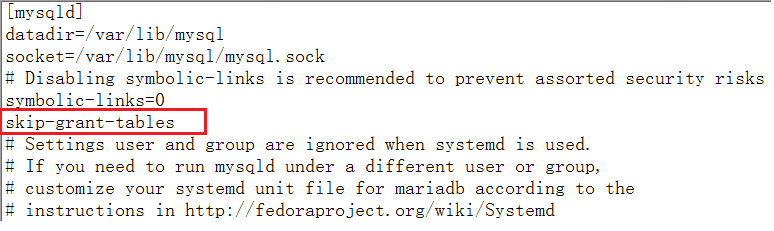

# Mysql无法登录
本文主要介绍2种场景导致的无法登录：忘记root密码、数据库文件损坏。

## 1.忘记root密码导致无法登录
当登陆mysql输入的密码错误时，提示Access denied，可以通过重置密码进行修复(以mariadb为例)。
```Bash
[jolycao2@VM_108_46_centos ~]$ mysql -uroot -p12345
ERROR 1045 (28000): Access denied for user 'root'@'localhost' 
(using password: YES)
```
### 修改/etc/my.cnf文件
在/etc/my.cnf中添加入如下配置项，用户可以无需密码就可以登陆数据库。
<br/>

### 登陆数据库
```Bash
[root@VM_108_46_centos ~]# mysql
Welcome to the MariaDB monitor.  Commands end with ; or \g.
Your MariaDB connection id is 40948
Server version: 5.5.60-MariaDB MariaDB Server
Copyright (c) 2000, 2018, Oracle, MariaDB Corporation Ab and others.
Type 'help;' or '\h' for help. Type '\c' to clear the current input statement.
MariaDB [(none)]>
```

### 重启mysql服务
```Bash
sudo systemctl restart mariadb.service
```

### 登陆数据库修改密码
```Bash
[root@VM_108_46_centos ~]# mysql
Welcome to the MariaDB monitor.  Commands end with ; or \g.
Your MariaDB connection id is 40948
Server version: 5.5.60-MariaDB MariaDB Server
Copyright (c) 2000, 2018, Oracle, MariaDB Corporation Ab and others.
Type 'help;' or '\h' for help. Type '\c' to clear the current input statement.
MariaDB [(none)]> use mysql
MariaDB [mysql]> set password for root@localhost = password('123456');
```

### 使用密码登陆数据库
```Bash
[root@VM_108_46_centos ~]# mysql -uroot -p123456
Welcome to the MariaDB monitor.  Commands end with ; or \g.
Your MariaDB connection id is 40949
Server version: 5.5.60-MariaDB MariaDB Server
Copyright (c) 2000, 2018, Oracle, MariaDB Corporation Ab and others.
Type 'help;' or '\h' for help. Type '\c' to clear the current input statement.
MariaDB [(none)]>
```

### 恢复/etc/my.cnf文件
删除下面的 "skip-grant-tables" 配置项。
<br/>

### 重启mysql服务
```Bash
sudo systemctl restart mariadb.service
```

## 2.数据库损坏导致无法登陆
mysql数据库损坏，如数据文件被删除，此时可以通过重装mysql解决。

### 停止服务
```Bash
sudo systemctl stop mariadb.service
```

### 卸载 mysql
以mariadb为例,这里的 mariadb* 表示删除所有 mariadb 相关联的组件：
```Bash
sudo yum remove mariadb*
```

### 删除残留的配置/数据文件
```Bash
sudo rm -f /etc/my.cnf       # 残留的配置文件
sudo rm -rf /var/lib/mysql/   # 残留的数据文件
````

### 重新安装
```Bash
sudo yum install mariadb*
```

### 启动服务
```Bash
sudo systemctl start mariadb.service
```

设接下来进行MariaDB的相关简单配置:
### 输入命令
```Bash
sudo mysql_secure_installation
首先是设置密码，会提示先输入密码
Enter current password for root (enter for none):<–初次运行直接回车
设置密码
Set root password? [Y/n] <– 是否设置root用户密码，输入y并回车或直接回车
New password: <– 设置root用户的密码, 比如 123456
Re-enter new password: <– 再输入一次你设置的密码， 123456

其他配置
Remove anonymous users? [Y/n] <– 是否删除匿名用户，回车
Disallow root login remotely? [Y/n] <–是否禁止root远程登录,回车,
Remove test database and access to it? [Y/n] <– 是否删除test数据库，回车
Reload privilege tables now? [Y/n] <– 是否重新加载权限表，回车
```

### 测试登录
初始化MariaDB完成，接下来测试登录：
```Bash
mysql -uroot -p123456
```
